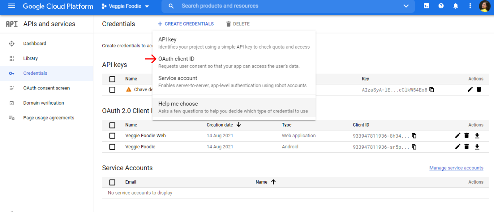
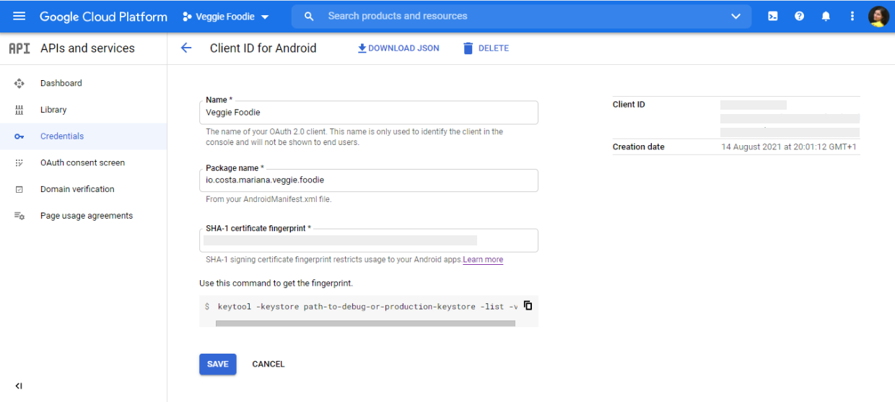
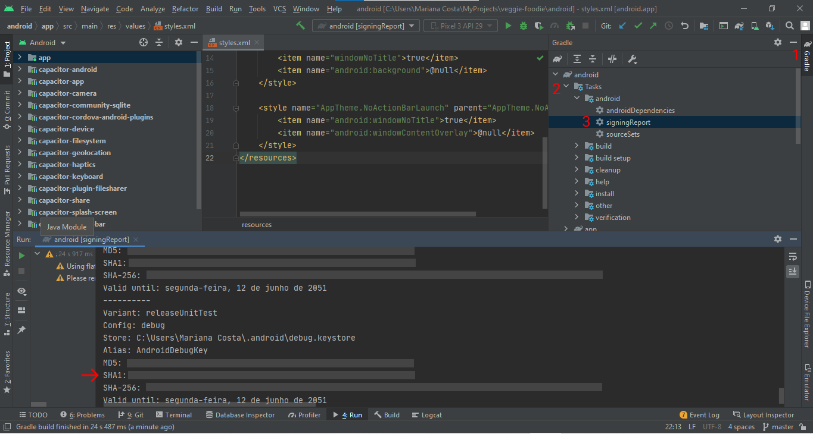
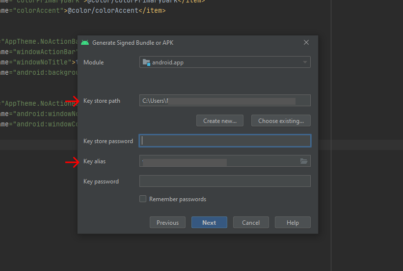
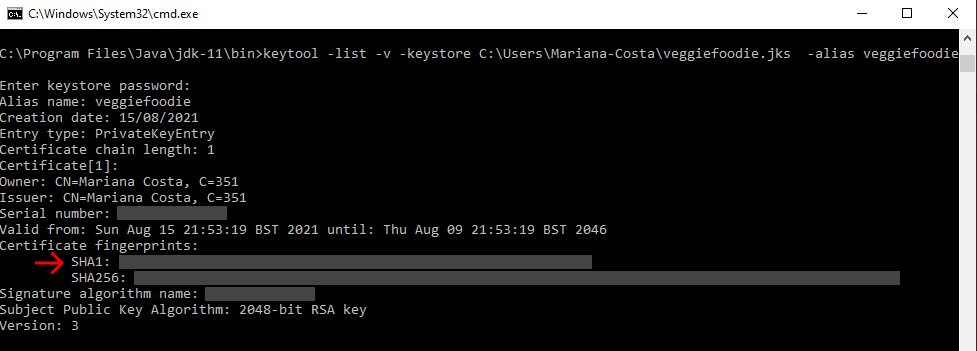

I've recently developed a cross-platform application with Ionic, Vue and Capacitor, and had some difficulties implementing Google OAuth2. Thus, I decided to write this article hoping that it may be useful for someone facing the same issues.
<br/>
Capacitor is native runtime for building cross-platform mobile apps with JavaScript, HTML, and CSS. It provides a native mobile app that wraps a web view that hosts our web application. In the end, you have a web app running inside a mobile app, which in certain cases may have as disadvantages some performance loss.
<br/><br/>

To implement Google OAuth in a Capacitor app, there are two main steps to consider:

- Configure your project in Google Cloud Platform
- Implement the code needed for Google OAuth2

### Configure your project in Google Cloud Platform

First, create a new project at [https://console.cloud.google.com/](https://console.cloud.google.com/). Then, on sidebar menu, go to _API and services_ -> _Credentials_ and add OAuth Client ID.


Now choose _Android_ in the application type field. This form needs the information that was the most difficult for me to obtain: the correct SHA-1 fingerprint.


An android app can have 2 SHA-1 keys: `debug` and `release` keys. In the Google Cloud Platform Project, store the correct SHA-1 key, according to the apk you generate to test the app in an android device. I.e. if the apk was generated for build variant debug store debug SHA-1 key; if the apk was generated for release store release SHA-1 key.

#### Get debug SHA-1 key:

In Android Studio, open your project and click on the Gradle Bar, on the right side panel (1). Click on _Tasks_ -> _android_ and double-click on `signingReport` (2). The debug key will be displayed in your terminal (3).



#### Get release SHA-1 key:

When you generate an apk using Android Studio, you must defined a keystore and a key alias. At this time, you must define an alias for the generated certificate and where to store it. Keep it safe because it contains important information.



To get your release key, you need to use the `keytool` command. Go to the JDK Directory in your file system e.g. `/Program Files/Java/jre-10.0.2/bin`, open a terminal there and run the command `keytool -list -v -keystore <path_to_the_certificate_with_keystore> -alias <alias_assigned_to_the_certificate>`.



#### Configure your OAuth consent screen

Add the scopes that you need for your app (e.g. email, profile), so they are presented on sign-in screen and the user can decide to grant or not your app the required permissions. Fill the other info in the form, if needed.

#### Create a OAuth Client ID for web application

You should also create an oAuth Client Id for web by choosing _Web application_ in the application type field, after clicking on add _OAuth Client ID_.

### Implement the code needed for Google OAuth2

I tested two plugins to implement Google OAuth in my app: `@byteowls/capacitor-oauth2@2.1.0` and `@codetrix-studio/capacitor-google-auth`. Here are the implementations that I've made for both of them:

#### Using Capacitor OAuth2 plugin

Install the plugin `yarn add @byteowls/capacitor-oauth2@2.1.0` (see [docs](https://www.npmjs.com/package/@byteowls/capacitor-oauth2) for more details) and sync the new plugin by running `npx cap sync`.

```js
<template>
  <ion-button
    expand="block"
    class="submit-button"
    @click="authenticateWithGoogle"
  >
    Authenticate with Google
  </ion-button>
</template>
<script>
import { IonButton } from '@ionic/vue'
import { OAuth2Client } from '@byteowls/capacitor-oauth2'
export default {
  components: {
    IonButton,
    IonIcon,
  },
  setup() {
    const oauth2Options = {
      authorizationBaseUrl: 'https://accounts.google.com/o/oauth2/auth',
      accessTokenEndpoint: 'https://www.googleapis.com/oauth2/v4/token',
      scope: 'email profile',
      resourceUrl: 'https://www.googleapis.com/userinfo/v2/me',
      logsEnabled: true,
      web: {
        appId: process.env.VUE_APP_OAUTH_CLIENT_ID_WEB,
        responseType: 'token',
        accessTokenEndpoint: '',
        redirectUrl: 'http://localhost:8100',
        windowOptions: 'height=600,left=0,top=0'
      },
      android: {
        appId: process.env.VUE_APP_OAUTH_CLIENT_ID_ANDROID,
        responseType: 'code',
        redirectUrl: '<your_package_name:/>'
      },
      ios: {
        appId: process.env.VUE_APP_OAUTH_CLIENT_ID,
        responseType: 'code',
        redirectUrl: '<your_package_name:/>'
      }
    }

    const authenticateWithGoogle = async () => {
      try {
        const userData = await OAuth2Client.authenticate(oauth2Options)
        const userData = {
          fullName: userResponse.name || userResponse.displayName,
          avatar: userResponse.picture,
          accessToken: userResponse.access_token,
          refreshToken: userResponse.authorization_response?.refresh_token
        }
        // add the code for the functionality your need
      } catch (error) {
        console.error(error)
      }
    }

    const logout = async () => {
      try {
        await OAuth2Client.logout()
      } catch (error) {
        console.error(error)
      }
    }

    onMounted(() => GoogleAuth.init())
    return {  authenticateWithGoogle, logout }
  },
}
</script>
```

<br/>

For Android, the documentation indicates to add the following configuration in `AndroidManifest.xml`

```xml
<intent-filter>
    <action android:name="android.intent.action.VIEW" />
    <category android:name="android.intent.category.DEFAULT" />
    <category android:name="android.intent.category.BROWSABLE" />
    <data android:scheme="@string/custom_url_scheme" android:host="oauth" />
</intent-filter>
```

<br/>
While testing my the app, I was not being able to install its apk in my android device. After some trial and error attempts, I figured out that if replaced the setup described in the docs by the code below, everything worked as expected.

```xml
<intent-filter>
  <action android:name="android.intent.action.MAIN" />
  <category android:name="android.intent.category.LAUNCHER" />
</intent-filter>
```

<br/>

#### Using Capacitor Google OAuth plugin

Install the plugin `yarn add @codetrix-studio/capacitor-google-auth` (see [docs](https://www.npmjs.com/package/@codetrix-studio/capacitor-google-auth) for more details) and sync the new plugin by running `npx cap sync`.

```js
<template>
<ion-button
  expand="block"
  class="submit-button"
  @click="authenticateWithGoogle"
>
  Authenticate with Google
</ion-button>
</template>
<script>
import { IonButton } from '@ionic/vue'
import { onMounted } from 'vue'
import { GoogleAuth } from '@codetrix-studio/capacitor-google-auth'
export default {
components: {
  IonButton,
  IonIcon,
},
setup() {
  const authenticateWithGoogle = async () => {
    try {
      const userResponse = await GoogleAuth.signIn()
      const userData = {
        fullName: userResponse.name || userResponse.displayName,
        avatar: userResponse.picture,
        accessToken: userResponse.access_token,
        refreshToken: userResponse.authorization_response?.refresh_token
      }
      // add the code for the functionality your need
    } catch (error) {
      console.error(error)
    }
  }

  const logout = async () => {
    try {
      await OAuth2Client.logout()
    } catch (error) {
      console.error(error)
    }
  }
    return {  authenticateWithGoogle, logout }
  },
}
</script>
```

For Android app, add the following configuration to `capacitor.config.json` file:

```json
{
  "plugins": {
    "GoogleAuth": {
      "scopes": ["profile", "email"],
      "serverClientId": "YOUR_WEB_OAUTH_CLIENT_ID",
      "forceCodeForRefreshToken": true
    }
  }
}
```

<br/>

Be aware that you must use the **Web OAuth Client ID** for these configurations, otherwise you'll not be able to sign-in when testing on a real android device.

For Android app, add the following configuration to `strings.xml` file:

```xml
<resources>
  <string name="server_client_id">YOUR_WEB_OAUTH_CLIENT_ID</string>
</resources>
```

<br/>

The documentation also indicates to add the following configuration to `MainActivity.java` file:

```java
package <your_package_name:/>;
import android.os.Bundle;
import com.getcapacitor.BridgeActivity;
import com.getcapacitor.Plugin;
import com.codetrixstudio.capacitor.GoogleAuth.GoogleAuth;
import java.util.ArrayList;
public class MainActivity extends BridgeActivity {
  @Override
  public void onCreate(Bundle savedInstanceState) {
    super.onCreate(savedInstanceState);
    this.init(savedInstanceState, new ArrayList<Class<? extends Plugin>>() {{
      add(GoogleAuth.class);
    }});
  }
}
```

<br/>

However, this configuration was causing errors for the other plugins implemented in the app, and apparently they needed to be activated in the same way as capacitor-google-auth plugin in `MainActivity.java` file. After some experiments, I found out that Google OAuth was working without this configuration, so I removed it. Just be sure that you have the plugin registered on `android\app\src\main\assets\capacitor.plugins.json` file.

```json
{
  "pkg": "@codetrix-studio/capacitor-google-auth",
  "classpath": "com.codetrixstudio.capacitor.GoogleAuth.GoogleAuth"
}
```

<br/>

And that's all I had to share. If you want to check the implementation of Google OAuth in the Ionic/Capacitor app I developed, you can check the code [here](https://github.com/marianapatcosta/veggie-foodie) and download the app [here](https://play.google.com/store/apps/details?id=io.costa.mariana.veggie.foodie).
Hope to "see" you in my next post .
